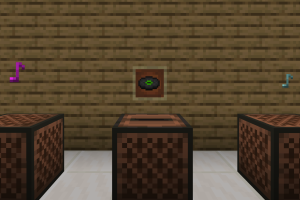

## MakeCode for Minecraft Education Extension

This repository is an approved **extension** in Microsoft MakeCode for Minecraft Education. If you would like to make changes or add features to this extension, feel free to open a PR or file an issue!

## Overview

This extension add music blocks to Microsoft MakeCode for Minecraft Education. Using the `/playsound` command underneath, the music blocks can help you hear popular Minecraft music discs like pigstep or make fun compositions with instruments or mob sounds. 

**Note** 
The extension can modify the volume at which the music plays, but will not modify the in-game music volume. If your music volume in your Minecraft Education world is low or off, you will not be able to hear the music from the blocks.

## Contributors
We want to express our gratitude to the following individuals who have contributed to this project:
- [@dbjorge](https://github.com/dbjorge)
- [@kduenke](https://github.com/kduenke)

Thanks for your valuable contributions! Your help has been greatly appreciated!

## Contributing

This project welcomes contributions and suggestions.  Most contributions require you to agree to a
Contributor License Agreement (CLA) declaring that you have the right to, and actually do, grant us
the rights to use your contribution. For details, visit https://cla.opensource.microsoft.com.

When you submit a pull request, a CLA bot will automatically determine whether you need to provide
a CLA and decorate the PR appropriately (e.g., status check, comment). Simply follow the instructions
provided by the bot. You will only need to do this once across all repos using our CLA.

This project has adopted the [Microsoft Open Source Code of Conduct](https://opensource.microsoft.com/codeofconduct/).
For more information see the [Code of Conduct FAQ](https://opensource.microsoft.com/codeofconduct/faq/) or
contact [opencode@microsoft.com](mailto:opencode@microsoft.com) with any additional questions or comments.

## Trademarks

This project may contain trademarks or logos for projects, products, or services. Authorized use of Microsoft 
trademarks or logos is subject to and must follow 
[Microsoft's Trademark & Brand Guidelines](https://www.microsoft.com/en-us/legal/intellectualproperty/trademarks/usage/general).
Use of Microsoft trademarks or logos in modified versions of this project must not cause confusion or imply Microsoft sponsorship.
Any use of third-party trademarks or logos are subject to those third-party's policies.